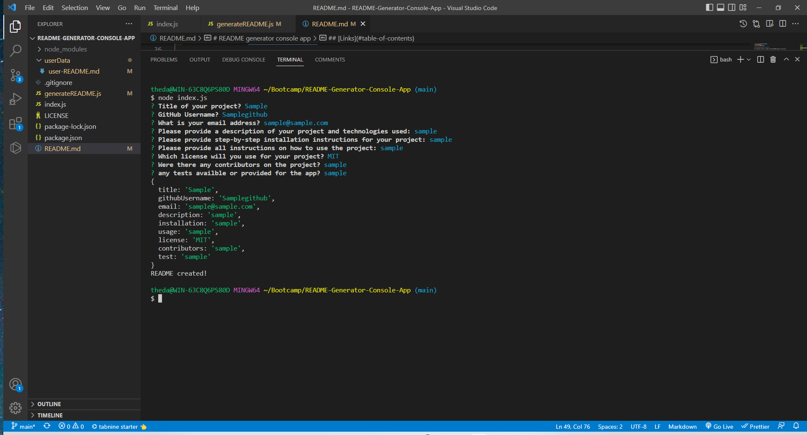
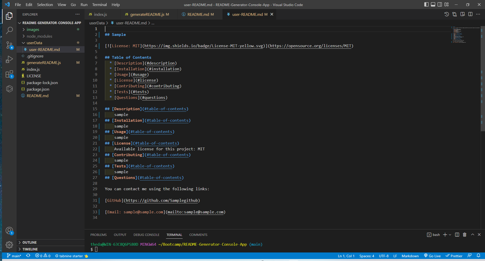

  # README generator console app
  
  

  ## Table of Contents
  * [Description](#description)
  * [Installation](#installation)
  * [Usage](#usage)
  * [Links](#links)
  * [License](#license)
  * [Contributing](#contributing)
  * [Tests](#tests)
  * [Questions](#questions)
  
  ## [Description](#table-of-contents)

  This repository contains a command line based README generator using node.js.

  
  

  ## [Installation](#table-of-contents)

  To install: Clone the repository on your local machine and run 'npm install' to install all the node_modules

  ## [Usage](#table-of-contents)

  After installing, run "node index.js" in the Command Line. You will recieve prompts for title, installation instuctions, usage, contributors, tests, license information, github address, and email address. a new user-readme file will be generated in the user folder and "Success!" will appear in the console. 
  
  ## [Links](#table-of-contents)

  [Repository](https://github.com/Thedanbrown/README-Generator-Console-App)

  ## [License](#table-of-contents)

  [MIT](https://opensource.org/licenses/MIT)

  ## [Contributing](#table-of-contents)
  No other contributing parties
    
  ## [Tests](#table-of-contents)    

  No current tests for this application

  ## [Questions](#table-of-contents)

  You can contact me using the following links:

  [GitHub](https://github.com/Thedanbrown)

  [Email: thedanbrown@gmail.com](mailto:thedanbrown@gmail.com)
